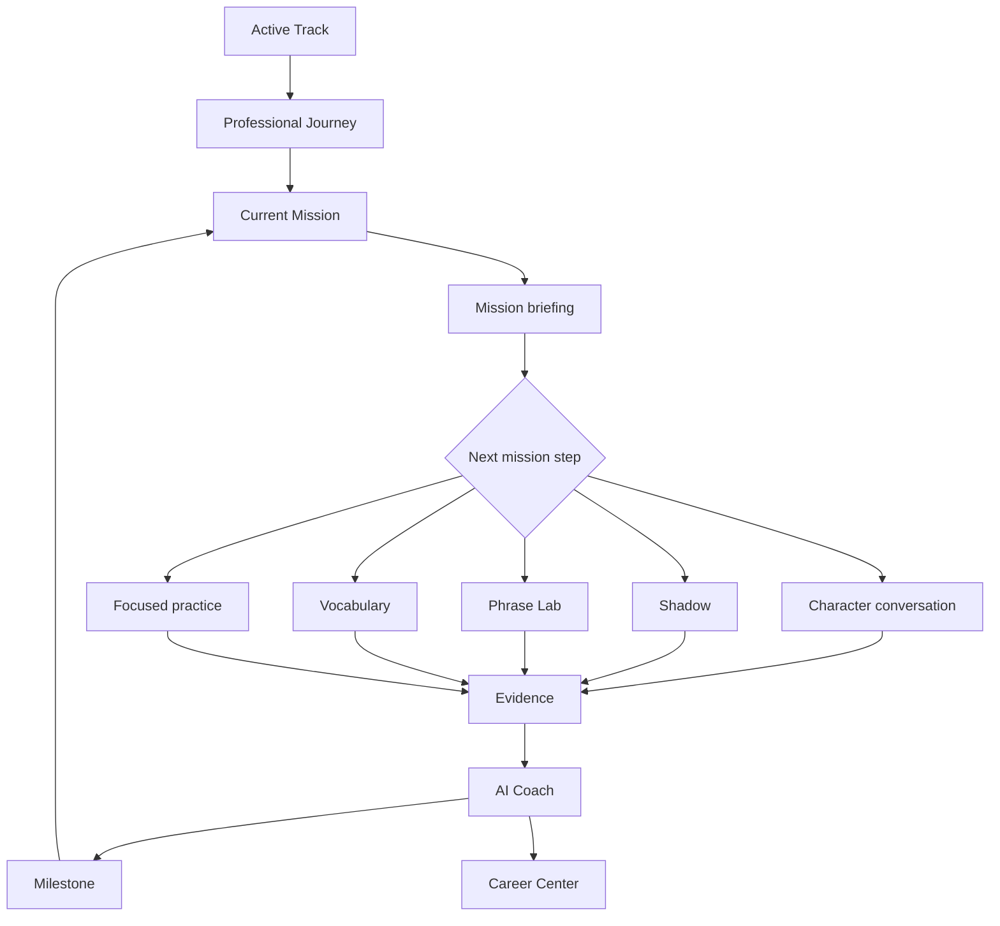

# Information Architecture — Career Journey

## North Star

The primary product object is a **Mission**. A mission is track-aware, stage-aware, evidence-aware, and time-bounded. Activities are not destinations in their own right; they are mission steps.

## Experience Map

## Primary Navigation

| Destination | Role | Contains |
|---|---|---|
| Home | Resume the career journey | current mission, coach note, track switcher |
| Journey | See professional progression | stages/weeks, milestones, current and future missions |
| Practice | Do purposeful independent practice | mission-linked practice and explicit free practice |
| Progress | Understand evidence and growth | timeline, milestones, weekly review, readiness explanation |
| Profile | Manage professional identity | Passport, destination, data/privacy, settings |

## Contextual Destinations

- **Mission** is opened from Home or Journey.
- **Character conversation** is opened from a mission step or an interviewer selection within a scenario.
- **Coach** follows evidence and is available from Progress.
- **Career Center** is opened from Profile or a relevant career milestone.
- **Passport** is an evidence view within Profile and Progress, not a separate competing navigation item.

## Mission State Model

`planned → active → evidence pending → reviewed → completed → next recommended`

Completion means the learner completed required steps. Demonstration requires observable production. The interface never merges these states.

## Content Ownership

| Data | Owner | Rule |
|---|---|---|
| Track, stages, mission definitions, character assignments | track pack | Versioned data, not view logic |
| Progress, activity log, saved vocabulary, recordings | learner state | Local-first; learner controlled |
| Readiness, achievements, milestones | derived engines | Explainable and evidence-bounded |
| Coach narrative and memory | coach layer | Track-scoped, bounded, grounded |
| Conversation response | conversation orchestration | Validated structure; no untrusted input controls state |

## General English Compatibility

General English remains a track. Its current week/day curriculum maps to the mission contract without changing its visual identity or lesson content. Professional tracks may use stages; the shared mission interface translates both into one learner experience.
