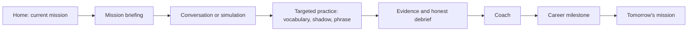

# UX Redesign — One Career Journey

## Design Intent

Reduce the product from a collection of tools to a calm professional journey. Each screen answers one learner question and has one primary action. Supporting detail is progressive disclosure, not another competing card.

## Before and After

| Before | After |
|---|---|
| Home promotes several activities and dashboards. | Home answers: “What is my next professional step?” |
| Practice is a mixed list of drills and conversation formats. | A mission presents the one or two activities needed now. |
| Simulation completion sends the learner toward unrelated practice. | Debrief returns the learner to the active mission or another interviewer in the same scenario. |
| Progress reports many counters. | Evidence answers what the learner has practised, demonstrated, and should do next. |
| Coach surfaces repeat the same competency language. | Coach speaks from recent evidence, remembered goals, and one next action. |

## Screen Contract

| Screen | Learner question | Primary action | Emotional result |
|---|---|---|---|
| Home | What is my next professional step? | Start today’s mission | Direction |
| Journey | Where am I going? | Open current mission | Momentum |
| Mission | What must I accomplish today? | Begin the next step | Confidence |
| Conversation | How do I handle this person and moment? | Hold to speak / tap to stop | Presence |
| Shadow | How should this sound at work? | Shadow this clip | Capability |
| Phrase Lab | What can I say clearly? | Practise this phrase | Fluency |
| Vocabulary | What should I retain and use? | Use this word in context | Relevance |
| Coach | What did I learn from my evidence? | Take the next action | Support |
| Evidence | What can I honestly show? | Review my evidence | Pride |
| Progress | What milestone am I building toward? | Continue journey | Progress |
| Career Center | How do I prepare for this destination? | Explore my next preparation step | Possibility |

## Navigation

Persistent navigation should retain only **Home**, **Journey**, **Practice**, **Progress**, and **Profile**. Practice is an intentional entry point for independent work; it must default to the active mission rather than a generic shelf. Coach, Passport, Career Center, and adaptive roadmap become contextual destinations from Home, Progress, or Profile.

The active track indicator is persistent. General English retains blue-violet; Welding uses accessible amber-on-charcoal. Colour never communicates the track or state alone: the track name is always written.

## Interaction Principles

- One primary action in the first viewport.
- Use concise, workplace-specific labels: “Brief Daniel,” not “Start activity.”
- Make mission steps explicit and finite.
- Keep microphone state unmistakable: ready/green, recording/amber, processing, ready/blue.
- Preserve 44px targets, keyboard operation, reduced motion, readable contrast, and empty/interrupted/offline states.
- Do not use pressure mechanics, leaderboard language, or achievement clutter.

## Ideal Learner Flow

The learner may enter Shadow, Phrase Lab, Vocabulary, or Practice directly, but each surface displays the active mission and offers a return to it.
