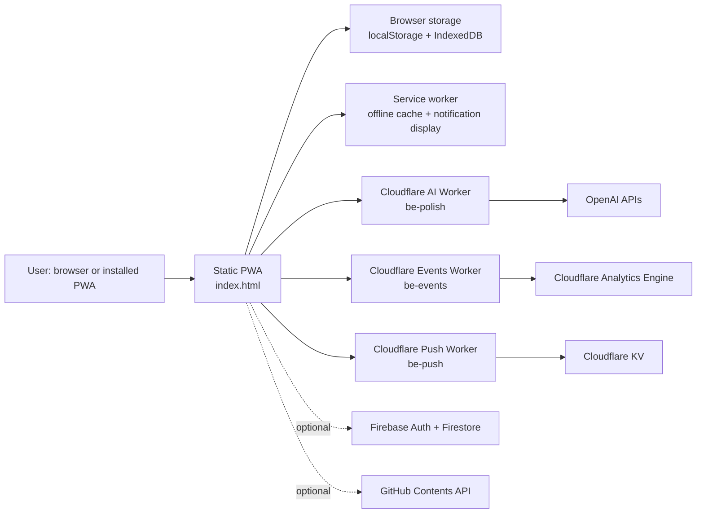
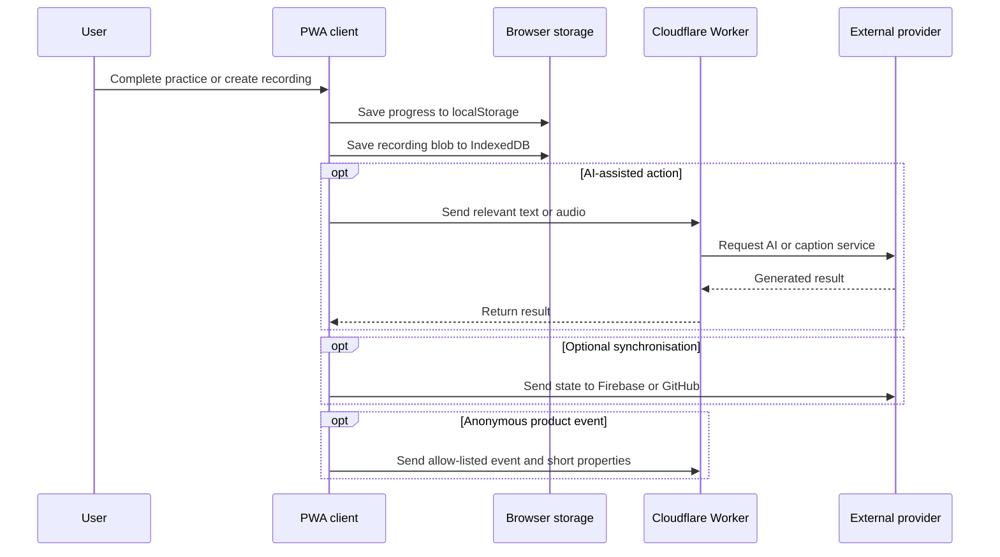

# System Overview

## Executive Summary

Business English Mastery (BE Mastery) is an offline-first progressive web application (PWA) for working professionals developing spoken business English and executive communication. The product delivers a structured 12-week programme of 84 daily sessions, combining guided practice, shadowing, phrase practice, vocabulary review, progress tracking, and selected AI-assisted feedback.

The application is intentionally client-led: the core learning experience, user state, and recordings work without an account and remain on the user’s device by default. Cloud services are used selectively for AI operations, optional account synchronisation, anonymous product analytics, and scheduled web-push reminders. The static application is hosted on GitHub Pages at `app.lomonec.com` and is packaged as an Android Trusted Web Activity for Google Play.

## Product Purpose

BE Mastery is positioned as an executive communication coach rather than a general-purpose language-learning application. Its purpose is to help professionals practise the concrete speaking behaviours needed for workplace interactions, including meetings, presentations, stand-ups, negotiation, feedback, and other business conversations.

The product centres on a repeatable daily practice habit: a 25-minute session within a 12-week learning journey. It provides the structure, practice materials, feedback mechanisms, and progress visibility needed to support sustained improvement.

## Business Problem Solved

Working professionals may have strong domain expertise while still lacking confidence, fluency, pronunciation control, or natural phrasing in English-speaking professional settings. General language-learning products often optimise for lesson completion or gamified engagement rather than workplace communication.

BE Mastery addresses this gap by combining a business-focused curriculum with practical speaking exercises, professional phrase practice, shadowing of authentic speech, and evidence of progress. Its offline-first design also reduces the requirement for continuous connectivity or mandatory account creation.

## Target Users

The repository’s product documentation describes the intended user as a competent adult professional who wants to communicate more confidently in English at work. The current product supports users who want to practise independently through a structured programme, including people preparing for or improving in:

- Meetings, stand-ups, and one-to-one conversations.
- Presentations, board updates, and executive communication.
- Interviews, workplace negotiation, and feedback discussions.
- Pronunciation, rhythm, vocabulary, and business phrasing.

## High-Level Architecture

The product consists of a static single-page web application, a service worker, static content assets, and three independent Cloudflare Workers. The application uses browser storage as its primary data layer; cloud persistence is optional.

### Client Application

[`index.html`](../../index.html) contains the application’s HTML, CSS, client-side JavaScript, learning content, routing, rendering logic, internationalisation source strings, and integration code. It is a framework-free single-page application with hash/session-based view navigation.

[`sw.js`](../../sw.js) provides the PWA shell’s network-first caching strategy, cached fallback for slow or unavailable networks, and display handling for daily reminder notifications. The PWA manifest and icon assets provide installability.

### Serverless Services

The backend consists of separate Cloudflare Workers under [`backend`](../../backend):

- `be-polish` is the AI gateway and holds the OpenAI secret.
- `be-events` accepts constrained anonymous product events and writes them to Analytics Engine.
- `be-push` manages daily reminder subscriptions and scheduled delivery using Cloudflare KV and a minute-level cron trigger.

Separating these Workers isolates the user-facing AI service from analytics and scheduled notification workloads.

## Major Components

| Component | Current responsibility |
|---|---|
| Learning journey and sessions | Delivers the 12-week programme, daily session checklist, 25-minute timer, notes, self-scores, and completion tracking. |
| Shadowing Studio | Loads YouTube clips, supports segment marking and looping, captures practice recordings, and presents speaking feedback. |
| Phrase Lab and Executive Polish | Provides business phrases and turns user-provided casual text into professional alternatives when the AI service is available. |
| Vocabulary and practice | Stores user vocabulary, supplies dictionary lookups, and schedules reviews through spaced repetition. |
| Progress features | Calculates streaks, session completion, calendar views, contribution-style history, and review metrics from local activity data. |
| Recording and speech layer | Uses browser microphone, speech recognition, speech synthesis, MediaRecorder, waveform analysis, and IndexedDB. |
| Account and data controls | Supports local export/import, optional Firebase synchronisation, and optional GitHub-based backup/synchronisation. |
| Localisation and help | Provides English source strings, 15 translation files, and localised manual pages. |
| PWA and reminders | Supports installability, offline use, in-app reminders, and web push where supported. |

## AI Capabilities

The current AI integration is accessed through the `be-polish` Cloudflare Worker, which keeps the OpenAI API key out of the browser and source repository. Implemented capabilities include:

- **Executive Polish:** produces multiple professional rewrites of user-provided text.
- **Natural text-to-speech:** creates MP3 audio for supported “Hear” and “Slow” actions, with browser speech synthesis as a fallback.
- **Transcription and word timing:** sends recorded audio to OpenAI Whisper to obtain transcript text and word positions.
- **Pronunciation assessment:** submits a target phrase and recording for per-word scoring through an OpenAI audio model; a Whisper-based assessment is available as a fallback in the Worker.
- **Scenario chat:** sends bounded scenario instructions and conversation history to `gpt-4o-mini` for role-play replies.
- **YouTube caption retrieval:** retrieves and parses available caption tracks for use in the Shadowing Studio.

Some role-play and pronunciation interfaces exist in the client source but are described in the repository documentation as hidden from the main navigation. They should not be represented as broadly available user-facing features without a product decision to expose them.

## Non-AI Capabilities

The product is useful without an AI response or account. Its non-AI capabilities include:

- Curriculum content, phrase bank, session timer, notes, self-scoring, and completion tracking.
- Browser-native speech recognition and speech synthesis.
- On-device recording storage and waveform/pace analysis.
- YouTube-based shadowing, clip looping, and local transcript/caption presentation.
- MediaPipe-based posture feedback when camera access is granted.
- Spaced-repetition vocabulary review and dictionary lookups.
- Light/dark themes, responsive PWA navigation, multilingual interface support, help content, and data export/import.
- Offline application-shell operation after caching; externally hosted content and online AI requests still require network access.

## External Services

| Service | Current use |
|---|---|
| GitHub Pages and custom domain | Static PWA hosting at `app.lomonec.com`. |
| Google Play | Android distribution through a Trusted Web Activity. |
| Cloudflare Workers | AI gateway, product-event collection, and push subscription/delivery logic. |
| Cloudflare KV | Stores web-push subscription records and completion flags. |
| Cloudflare Analytics Engine and Web Analytics | Stores allow-listed anonymous product events; records page views, referrers, and web-vitals-style analytics. |
| OpenAI | Chat completions, text-to-speech, transcription, and pronunciation assessment. |
| Firebase Authentication and Firestore | Optional user authentication and cloud synchronisation of serialized application state. |
| GitHub Contents API | Optional user-managed backup/synchronisation of progress and recordings to a private repository. |
| YouTube | Video playback, thumbnails, and caption sources for shadowing exercises. |
| MediaPipe | Browser-loaded pose-landmark model for posture coaching. |
| DictionaryAPI.dev | English dictionary definitions and related pronunciation data. |
| Google Fonts | Web font delivery. |

## Data Flow

The primary data flow is local. Application state is saved as a single state object in browser `localStorage`; recordings are stored as blobs in IndexedDB. Core usage does not require cloud storage.

For reminders, the client registers a random device-level identifier, scheduled UTC slot, and browser push endpoint with `be-push`. The Worker stores that information in KV. When the user marks a practice activity complete, the client informs the Worker so the scheduled notification can be skipped for that user that day. Notification wording is cached in the service worker rather than sent as a push payload.

## Current Strengths

- **Offline-first and privacy-conscious core:** progress and recordings stay local by default, and the product remains usable without a cloud account.
- **Clear product focus:** the 12-week programme connects practice activities to executive communication rather than generic language-learning mechanics.
- **Layered resilience:** browser-native capabilities and local logic provide fallback when AI services, network access, or optional cloud services are unavailable.
- **Secret isolation:** the primary OpenAI key is held in the Cloudflare Worker rather than exposed in the client application.
- **Workload separation:** AI, event capture, and scheduled push processing are implemented as separate Workers.
- **Data-minimised analytics:** the events Worker uses allow-listed event names and bounded properties; the repository documentation explicitly excludes recordings, transcripts, phrase text, profile fields, and device IDs.
- **Low operational footprint:** static hosting, browser storage, and serverless services reduce baseline infrastructure requirements.

## Current Technical Limitations

- **Monolithic client implementation:** the main application is a large single `index.html` file containing UI, state, content, and integrations. This makes independent testing, ownership, and change isolation difficult.
- **Limited automated delivery controls:** the repository contains a manual test checklist, but no package manifest, automated test suite, lint/type configuration, or CI workflow was found.
- **Browser capability variance:** speech recognition, microphone access, push, and camera features depend on browser/platform support. The repository documents reduced or unavailable support in several browser and iOS scenarios.
- **Local-first synchronisation trade-offs:** Firebase state is serialized as a JSON field, while GitHub sync uses the browser-held token configured by the user. Neither approach provides repository-visible schema management or server-side conflict-resolution infrastructure.
- **Worker rate-limit scope:** AI Worker counters are held in process memory, so limits are not a durable, globally coordinated abuse-control mechanism.
- **Deployment configuration dependency:** the push Worker configuration includes placeholders for its KV namespace and VAPID public key; production deployment depends on correctly supplied Cloudflare configuration and secrets.
- **External dependency availability:** AI responses, YouTube media/captions, dictionary data, Firebase sync, GitHub sync, and hosted fonts rely on third-party availability and network connectivity.

## Long-Term Architecture Vision

The repository does not define a committed target architecture beyond the current client-led PWA and Cloudflare Worker design. For enterprise readiness, the appropriate evolution is to preserve the local-first product model while making the implementation more modular, observable, and governable.

The likely architectural direction is:

1. Separate the monolithic client into independently testable modules for views, learning-domain logic, persistence, integrations, and shared UI.
2. Introduce explicit, versioned data contracts for client state and Worker APIs before expanding cross-device or multi-client use.
3. Add automated validation for client behavior, Worker request/response contracts, offline behavior, and release readiness.
4. Move operational configuration, secret handling, observability, quotas, and abuse controls into managed, repeatable deployment practices.
5. Retain graceful local fallbacks so optional AI and cloud services enhance the product rather than becoming prerequisites for core learning.

This direction is an architectural recommendation based on the current repository, not a statement that these changes are already implemented or scheduled.
